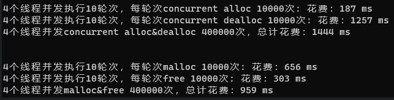

# C++高并发内存池

### 项目简介
**该项目实现了一个高并发内存池，参考了google的开源项目[tmalloc](https://github.com/google/tcmalloc)实现的简易版；其功能就是实现高效的多线程内存管理。由功能可知，高并发指的是高效的多线程，而内存池则是实现内存管理的**

### 内存池的介绍

- #### 1、池化技术
  我们知道，向系统申请和释放资源都有较大的开销，而池化技术就是程序先向系统申请过量的资源，而这些资源由我们自己管理，这样就能避免频繁的申请和释放资源导致的开销。
  其实，在计算机中，除了我们上面所说的内存池，还有我们之前提到过的数据结构池，以及线程池、对象池、连接池等等，都利用了池化技术。

- #### 2、内存池
  内存池指的是程序预先向操作系统申请足够大的一块内存空间；此后，程序中需要申请内存时，不需要直接向操作系统申请，而是直接从内存池中获取；同理，程序释放内存时，也不是将内存直接还给操作系统，而是将内存归还给内存池。当程序退出（或者特定时间）时，内存池才将之前申请的内存真正释放。

- #### 3、内存池主要解决的问题
  由上可知，内存池首要解决的是效率问题，其次从系统的内存分配器角度出发，还需要解决内存碎片的问题。那么什么是内存碎片问题呢？
  内存碎片分为外碎片和内碎片。

> - **外碎片**：对于我们申请的内存，可能因为频繁的申请和释放内存导致内存空间不连续，那么就会出现明明由足够大的内存空间，但是我们却申请不出连续的空间出来，这便是外碎片问题了。
> - **内碎片**：内碎片则是由于一些对齐的需求，导致分配出去的内存空间无法被利用。

### 随着开发环境逐渐多核多线程，那么在申请内存的场景下，必然存在激烈的锁竞争问题。其实，malloc本身就已经足够优秀了，但我们项目的原型tcmalloc将在多线程高并发的场景下更胜一筹。而我们这次实现的内存池将考虑以下几方面的问题：

- 1.性能问题
- 2.多线程场景下的锁竞争问题
- 3.内存碎片问题
**concurrent memory pool（并发内存池），主要有以下3个部分组成：**
#### 1.线程缓存（thread cache）
线程缓存是每个线程独有的，用于小于256kb内存的分配。那么对于每一个线程从thread cache申请资源，就无需考虑加锁问题，每个线程独享一个缓存（cache），这也是并发线程池高效的地方。

#### 2.中心缓存（central cache）
中心缓存有所有线程所共享，thread cache 按需从central cache处获取对象，而central cache在合适的时机从thread cache处回收对象从而避免一个线程占用太多资源，导致其他线程资源吃紧，进而实现内存分配在多个线程更加均衡的按需调度。由于所有thread cache都从一个central cache中取内存对象，故central cache是存在竞争的，也就是说从central cache中取内存对象需要加锁，但我们在central cache这里用的是桶锁，且只有thread cache中没有对象后才会来central cache处取对象，因此锁的竞争不会很激烈。

#### 3.页缓存（page cache）
页缓存是中心缓存上一级的缓存，存储并分配以页为单位的内存，central cache中没有内存对象时，会从page cache中分配出一定数量的page，并切割成定长大小的小块内存，给central cache。当page cache中一个span的几个跨度页都回收以后，page cache会回收central cache中满足条件的span对象，并且合并相邻的页，组成更大的页，从而缓解内存碎片（外碎片）的问题。

### 具体实现
#### 1、Thread Cache核心实现
thread cache是哈希桶结构，每个桶是一个根据桶位置映射的挂接内存块的自由链表，每个线程都会有一个thread cache对象，这样就可以保证线程在申请和释放对象时是无锁访问的。

#### 申请与释放内存的规则及无锁访问
- 申请内存
当内存申请大小size不超过256KB，则先获取到线程本地存储的thread cache对象，计算size映射的哈希桶自由链表下标i。
如果自由链表_freeLists[i]中有对象，则直接Pop一个内存对象返回。
如果_freeLists[i]中没有对象时，则批量从central cache中获取一定数量的对象，插入到自由链表并返回一个对象。
- 释放内存
<ol>
<li>当释放内存小于256kb时将内存释放回thread cache，计算size映射自由链表桶位置i，将对象Push到_freeLists[i]。</li>
<li>当链表的长度过长，则回收一部分内存对象到central cache。</li>
</ol>

- tls - thread local storage \
线程局部存储(tls)，是一种变量的存储方法，这个变量在它所在的线程内是全局可访问的，但是不能被其他线程访问到，这样就保持了数据的线程独立性。而熟知的全局变量，是所有线程都可以访问的，这样就不可避免需要锁来控制，增加了控制成本和代码复杂度。

#### 2、Central Cache核心实现
central cache也是一个哈希表结构，其映射关系与thread cache是一样的，不同的是central cache的哈希桶位置所挂接的是SpanList链表结构，不过每个桶下的span对象被切分成了一块块小内存挂接在span对象的自由链表freeList中。

#### 申请与释放内存规则
- 申请内存
<ol>
<li>当thread cache中没有内存后，就会向central cache中申请大块内存。这里的申请过程采用的是类似网络tcp协议拥塞控制的慢开始算法，而central cache中哈希映射的spanlist下挂着的span则向thread cache提供大块内存，而从span中取出对象给thread cache是需要加锁的，这里为了保证效率，提供的是桶锁。</li>
</ol>

### 编译运行
```
mkdir build && cd build
```

```
cmake ..
```

```
make
```

### 未使用基数树的性能测试



### TODO

- [x]  定长的内存池
- [x]  支持windows和linux
- [x]  实现初步三级缓存
- [x]  单元测试
- [x]  基准测试
- [ ]  基数树优化

